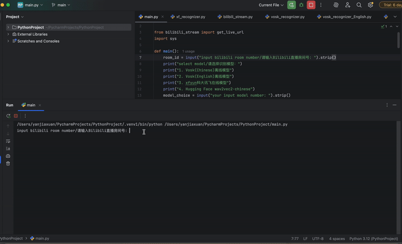

# bilibili.com Live immediate Speech-to-Text (Chinese + English)

基于B站直播的实时语音听写(中英双语）

---

## Features / 功能介绍

This project aims to help people who watch live streams but cannot hear the audio — such as people with hearing-issue or users in environments where sound cannot be played.  At the same time, it aims to improve the subtitle alignment speed and recognition accuracy, making it a better experience. It mainly focused on:

- 🔊 **Auto Live Audio Extraction/自动获取直播音频流(b站)**\
  Automatically fetches the audio stream from a Bilibili livestream via room ID.

- 🌐 **Multilingual Speech Recognition/英汉双语识别**\
  Supports **Chinese** and **English** recognition via Vosk offline models (and experimental HuggingFace models).

- **Integrate different models/整合不同模型**\
  Including Vosk offline models(trained) + xfyun online models + Huggingface transformers (**state-of-the-art self-supervised learning** model by Facebook AI Meta), which are listed in the [Model Zoo](#model-zoo) below.

- 🛠️ **Developer-Friendly WebSocket API/通过websocket实时输出接口**\
  Exposes a standard WebSocket interface that developers can easily integrate into **web overlays, Python/Node.js services, etc.** Automatic result push over WebSocket for each recognition segment (no polling required)

- 🚨 **Clean & Readable Output/识别输出优化**\
  Filters out unnecessary pauses, repeated tokens, and space noise for better readability.

## Example feature / 示例效果





---

## 🎓 Requirements

- Python 3.10+
  
Install dependencies:
```bash
pip install -r requirements.txt
```

---

## 📖 Usage

### Step 1: Download models
if you just want to run this code provided models, please download:
 [Vosk](https://alphacephei.com/vosk/models/vosk-model-small-en-us-0.15.zip) 
 [Vosk](https://alphacephei.com/vosk/models/vosk-model-small-cn-0.22.zip) 
 
 ***Please CREATE A FOLDER named `model` in the project root directory and put them inside:  
 For example:
 - `model/vosk-model-small-en-us-0.15`
 
 [HuggingFace](https://huggingface.co/jonatasgrosman/wav2vec2-large-xlsr-53-chinese-zh-cn/tree/main) 
 
 ***CREATE A FOLDER 'wav2vec2-chinese' in 'model' file, and put the trained models package into it
 For example:
 - `model/wav2vec2-chinese/config.json`

or if you want the whole model zoo, you can find it below.

### Step 2: Run the main program

```bash
python main.py
```

### Step 3: Input bilibili live Room ID and Choose Model

```bash
input bilibili room number/请输入Bilibili直播房间号: 1

select model/请选择识别模型：
1. Vosk(Chinese)离线模型
2. Vosk(English)离线模型
3. xfyun科大讯飞在线模型
4. Hugging Face wav2vec2-chinese
your input model: 3
```

### Step 4: Start Recognition

```bash
直播流地址：https://...
开始识别 (Vosk)...
识别结果: 大家好，欢迎来到直播间
识别结果: Let's begin with today's live
```

---

## Model Zoo

**1. Vosk** has provided more pretrained offline models for different languages, apart from the two given model of this project, download here:

🔗 [https://alphacephei.com/vosk/models](https://alphacephei.com/vosk/models)

for immediate speech-to-text task, I chose 2 small models. Though large models provide more precision, they also reduce speed, causing a delay:

| **Example vosk model：**       |     |         |                      |
| ----------------------------- | --- | ------- | -------------------- |
| `vosk-model-small-cn-0.22`    | CHN | \~50MB  | small model          |
| `vosk-model-small-en-us-0.15` | ENG | \~40MB  |                      |
| `vosk-model-en-us-0.22`       | ENG | \~1.8GB | more precision, slow |
| `vosk-model-cn-0.22`          | CHN | \~1.8GB |                      |

---

**2. HuggingFace** **Wav2Vec2** is a state-of-the-art **self-supervised speech representation learning model** developed by Facebook AI (Meta). It is trained on raw unlabeled audio and fine-tuned on transcribed speech for tasks like automatic speech recognition (ASR).

Chinese pretrained: [https://huggingface.co/urarik/chinese-wav2vec2-large-CV16](https://huggingface.co/urarik/chinese-wav2vec2-large-CV16)\
English pretrained: [https://huggingface.co/facebook/wav2vec2-base-960h](https://huggingface.co/facebook/wav2vec2-base-960h)

---

**3. xfyun（科大讯飞）Online Speech Recognition**\
xfyun is a powerful cloud-based ASR engine developed by iFLYTEK (科大讯飞), providing real-time speech-to-text conversion with high accuracy for both Chinese and English.\
in this project, since it is online, we don't need any models downloaded, just run the main.py and choose it.
Website：[https://www.xfyun.cn/services/online\_asr](https://www.xfyun.cn/services/online_asr)

A wider usage requires registering an API key on the iFLYTEK open platform, and this project already includes basic integration logic in `xf_recognizer.py`.

---

## 📂 Directory Structure

```
project/
├── main.py
├── bilibili_stream.py
├── vosk_recognizer.py
├── vosk_recognizer_English.py
├── model_loader.py
├── xf_recognizer.py
├── hf_recognizer.py
├── requirement.txt
├── model/
│   ├── vosk-model-small-cn-0.22/
│   └── vosk-model-small-en-us-0.15/
|    ......
```

---

## 🙏 Credits

- [Vosk Speech Recognition](https://alphacephei.com/vosk/)
- [HuggingFace Transformers](https://huggingface.co/models)
- Bilibili Open Platform
